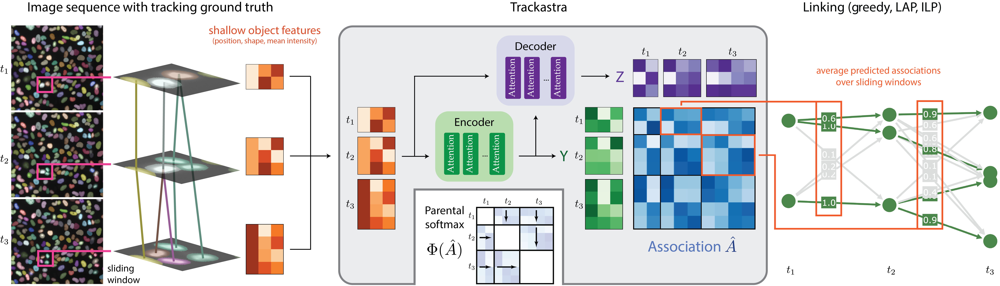

<div align="center">
  
</div>

# *Trackastra* - Tracking by Association with Transformers


*Trackastra* is a cell tracking approach that links already segmented cells in a microscopy timelapse by predicting associations with a transformer model that was trained on a diverse set of microscopy videos.



If you are using this code in your research, please cite our [paper](https://www.ecva.net/papers/eccv_2024/papers_ECCV/papers/09819.pdf):
> Benjamin Gallusser and Martin Weigert<br>*Trackastra - Transformer-based cell tracking for live-cell microscopy*<br> European Conference on Computer Vision, 2024

## Examples
Nuclei tracking | Bacteria tracking
:-: | :-:
<video src='https://github.com/weigertlab/trackastra/assets/8866751/807a8545-2f65-4697-a175-89b90dfdc435' width=180></video>| <video src='https://github.com/weigertlab/trackastra/assets/8866751/e7426d34-4407-4acb-ad79-fae3bc7ee6f9' width=180/></video>

## Installation
This repository contains the Python implementation of Trackastra.

Please first set up a Python environment (with Python version 3.10 or higher), preferably via [conda](https://conda.io/projects/conda/en/latest/user-guide/install/index.html) or [mamba](https://mamba.readthedocs.io/en/latest/installation/mamba-installation.html#mamba-install).

Trackastra can then be installed from PyPI using `pip`:
```bash
pip install trackastra
```

For tracking with an integer linear program (ILP, which is optional)
```bash
conda create --name trackastra python=3.10 --no-default-packages
conda activate trackastra
conda install -c conda-forge -c gurobi -c funkelab ilpy
pip install "trackastra[ilp]"
```

Notes:
- For the optional ILP linking, this will install [`motile`](https://funkelab.github.io/motile/index.html) and binaries for two discrete optimizers:

  1. The [Gurobi Optimizer](https://www.gurobi.com/). This is a commercial solver, which requires a valid license. Academic licenses are provided for free, see [here](https://www.gurobi.com/academia/academic-program-and-licenses/) for how to obtain one.

  2. The [SCIP Optimizer](https://www.scipopt.org/), a free and open source solver. If `motile` does not find a valid Gurobi license, it will fall back to using SCIP.
- On MacOS, installing packages into the conda environment before installing `ilpy` can cause problems.
- 2024-06-07: On Apple M3 chips, you might have to use the nightly build of `torch` and `torchvision`, or worst case build them yourself.

## Usage

The input to Trackastra is a sequence of images and their corresponding cell (instance) segmentations.

### Napari plugin 

For a quick try of Trackastra on your data, please use our [napari plugin](https://github.com/weigertlab/napari-trackastra/), which already comes with pretrained models included.


### Tracking with a pretrained model

> The available pretrained models are described in detail [here](trackastra/model/pretrained.json).

Consider the following python example script for tracking already segmented cells. All you need are the following two numpy arrays:
- `imgs`: a microscopy time lapse of shape `time,(z),y,x`.
- `masks`: corresponding instance segmentation of shape `time,(z),y,x`.

The predicted assocations can then be used for linked with several modes:

- `greedy_nodiv`  (greedy linking with no division) - fast, no additional dependencies
- `greedy`        (greedy linking with division) - fast, no additional dependencies
- `ilp`          (ILP based linking) - slower but more accurate, needs [`motile`](https://github.com/funkelab/motile)

Apart from that, no hyperparameters to choose :)

```python
import torch
from trackastra.model import Trackastra
from trackastra.tracking import graph_to_ctc, graph_to_napari_tracks
from trackastra.data import example_data_bacteria

device = "cuda" if torch.cuda.is_available() else "cpu"

# load some test data images and masks
imgs, masks = example_data_bacteria()

# Load a pretrained model
model = Trackastra.from_pretrained("general_2d", device=device)

# or from a local folder
# model = Trackastra.from_folder('path/my_model_folder/', device=device)

# Track the cells
track_graph = model.track(imgs, masks, mode="greedy")  # or mode="ilp", or "greedy_nodiv"


# Write to cell tracking challenge format
ctc_tracks, masks_tracked = graph_to_ctc(
      track_graph,
      masks,
      outdir="tracked",
)
```

You then can visualize the tracks with [napari](https://github.com/napari/napari):

```python
# Visualise in napari
napari_tracks, napari_tracks_graph, _ = graph_to_napari_tracks(track_graph)

import napari
v = napari.Viewer()
v.add_image(imgs)
v.add_labels(masks_tracked)
v.add_tracks(data=napari_tracks, graph=napari_tracks_graph)
```

### Training a model on your own data

To run an example
- clone this repository and got into the scripts directory with `cd trackastra/scripts`.
- download the [Fluo-N2DL-HeLa](http://data.celltrackingchallenge.net/training-datasets/Fluo-N2DL-HeLa.zip) dataset from the Cell Tracking Challenge into `data/ctc`.

Now, run
```bash
python train.py --config example_config.yaml
```

Generally, training data needs to be provided in the [Cell Tracking Challenge (CTC) format](http://public.celltrackingchallenge.net/documents/Naming%20and%20file%20content%20conventions.pdf), i.e. annotations are located in a folder containing one or several subfolders named `TRA`, with masks and tracklet information.
